<div align="center">
  
</div>

<p align="center">
  
</p>

<div align="center">
  
  <!-- Typing SVG with multiple lines -->
  <a href="https://git.io/typing-svg">
    
  </a>

  <br><br>

  
  
  
  
</div>


<br>

<table width="100%" style="border: none;">
<tr>
<td width="55%" valign="top" style="border: none;">

##  About Me

```javascript
const harshana = {
    location: "🇱🇰 Sri Lanka",
    education: "🎓 BSc (Hons) Software Engineering",
    currentRole: "💼 Full Stack Developer",
    expertise: ["MERN Stack", "Frontend Magic", "Backend Wizardry"],
    passions: ["🎨 UI/UX Design", "☁️ Cloud Computing", "🤖 AI Integration"],
    lifePhilosophy: "Code with ❤️, Ship with 🚀",
    currentlyLearning: ["Next.js", "TypeScript", "Docker"],
    funFact: "I debug in my dreams 💭",
    collaborate: "✅ Open for exciting projects!",
    askMeAbout: ["MERN Stack", "Web Dev", "Best Coding Practices"],
    reachMe: "📧 harshanasamarathunga2001@gmail.com"
};

console.log("Let's build something amazing! 🚀");
```

### 🎯 **Quick Highlights:**

- 🌱 Currently mastering **BSc (Hons) Software Engineering**
- 👯 Looking to collaborate on **innovative web projects**
- 💬 Ask me about **MERN stack development**
- 📫 Reach me at **harshanasamarathunga2001@gmail.com**
- ⚡ Fun fact: **Lusifer** 😈

</td>
<td width="45%" align="center" valign="top" style="border: none;">
<br><br>


### 🔥 **My Coding Journey**

```text
🎯 Projects Completed     ████████████░░  85%
⚡ Problem Solving        ███████████░░░  90%
🎨 UI/UX Skills          ██████████░░░░  80%
🚀 Full Stack Mastery    ███████████░░░  88%
☁️ Cloud Knowledge       ████████░░░░░░  65%
```

</td>
</tr>
</table>


<br>

##  Connect With Me

<div align="center">

<a href="https://fb.com/harshana.malshan" target="_blank">
  
</a>
<a href="https://www.linkedin.com/in/your-linkedin-profile/" target="_blank">
  
</a>
<a href="mailto:harshanasamarathunga2001@gmail.com">
  
</a>
<a href="https://github.com/sdhmsamarathunga" target="_blank">
  
</a>
<a href="#" target="_blank">
  
</a>

### 💌 **Let's Create Something Amazing Together!**

</div>


<br>

##  Tech Stack & Arsenal

<div align="center">

###  **Languages**

<p>
  
  
  
  
  
  
</p>

### 🎨 **Frontend Development**

<p>
  
  
  
  
  
  
  
  
</p>

### ⚙️ **Backend Development**

<p>
  
  
  
  
  
</p>

### 🗄️ **Databases & Cloud**

<p>
  
  
  
  
  
</p>

### 🛠️ **Tools & Technologies**

<p>
  
  
  
  
  
  
  
  
</p>

### 🌐 **All Technologies (Visual)**

<p align="center">
  
</p>

</div>


<br>

## 📊 GitHub Statistics & Analytics

<div align="center">

<details open>
<summary><b>📈 Detailed Stats</b></summary>
<br>

<table width="100%" style="border: none;">
<tr>
<td width="50%" style="border: none;">

</td>
<td width="50%" style="border: none;">

</td>
</tr>
</table>

<table width="100%" style="border: none;">
<tr>
<td width="50%" style="border: none;">

</td>
<td width="50%" style="border: none;">

</td>
</tr>
</table>

</details>

<details open>
<summary><b>📉 Contribution Graph</b></summary>
<br>


</details>

<details open>
<summary><b>🔥 Heatmap</b></summary>
<br>


</details>

</div>


<br>

## 🏆 GitHub Trophies & Achievements

<div align="center">


### 🎯 **Achievement Badges**


<table width="100%" style="border: none;">
<tr>
<td width="50%" style="border: none;">

</td>
<td width="50%" style="border: none;">

</td>
</tr>
<tr>
<td width="50%" style="border: none;">

</td>
<td width="50%" style="border: none;">

</td>
</tr>
</table>

</div>


<br>

## 💼 What I'm Working On

```mermaid
%%{init: {'theme':'dark', 'themeVariables': { 'primaryColor':'#00f7ff','primaryTextColor':'#fff','primaryBorderColor':'#00f7ff','lineColor':'#00f7ff','secondaryColor':'#006064','tertiaryColor':'#0D1117'}}}%%
graph TB
    A[👨‍💻 Harshana Malshan] --> B[🎓 Education]
    A --> C[💻 Development]
    A --> D[🚀 Goals]
    
    B --> B1[BSc Software Engineering]
    B --> B2[Advanced MERN Stack]
    B --> B3[Cloud Technologies]
    
    C --> C1[Web Applications]
    C --> C2[UI/UX Projects]
    C --> C3[Full Stack Solutions]
    
    D --> D1[Open Source Contributions]
    D --> D2[Freelance Projects]
    D --> D3[Tech Community]
    
    style A fill:#00f7ff,stroke:#fff,stroke-width:3px,color:#000
    style B fill:#ff6b6b,stroke:#fff,stroke-width:2px
    style C fill:#4ecdc4,stroke:#fff,stroke-width:2px
    style D fill:#ffe66d,stroke:#fff,stroke-width:2px
```

<div align="center">



</div>

<br>

<div align="center">

### 🎯 **Current Focus Areas**

| Area | Status | Priority |
|------|--------|----------|
| 🚀 Next.js & TypeScript | 🟢 In Progress | ⭐⭐⭐⭐⭐ |
| ☁️ AWS & Cloud Services | 🟡 Learning | ⭐⭐⭐⭐ |
| 📱 React Native | 🟠 Planning | ⭐⭐⭐ |
| 🤖 AI Integration | 🔵 Exploring | ⭐⭐⭐⭐ |
| 🎨 Advanced UI/UX | 🟢 Ongoing | ⭐⭐⭐⭐⭐ |

</div>


<br>

## 🎯 2025 Goals & Roadmap

<div align="center">

```text
┌─────────────────────────────────────────────────────────────┐
│  Q1 2025                                                    │
│  ✅ Master Next.js & Server Components                      │
│  ✅ Complete 5 Full Stack Projects                          │
│  🔄 Contribute to 10 Open Source Projects                   │
└─────────────────────────────────────────────────────────────┘

┌─────────────────────────────────────────────────────────────┐
│  Q2 2025                                                    │
│  🎯 Launch Personal Portfolio v2.0                          │
│  🎯 Start Technical Blog                                    │
│  🎯 Learn Docker & Kubernetes                               │
└─────────────────────────────────────────────────────────────┘

┌─────────────────────────────────────────────────────────────┐
│  Q3-Q4 2025                                                 │
│  📱 Build React Native Apps                                 │
│  ☁️ AWS Solutions Architect Cert                            │
│  🤝 Mentor Junior Developers                                │
└─────────────────────────────────────────────────────────────┘
```

</div>


<br>

## 💡 Dev Quote of the Day

<div align="center">
  
  
  
</div>


<br>

## 🐍 Contribution Snake

<div align="center">
  
  <picture>
    <source media="(prefers-color-scheme: dark)" srcset="https://raw.githubusercontent.com/sdhmsamarathunga/sdhmsamarathunga/output/github-contribution-grid-snake-dark.svg">
    <source media="(prefers-color-scheme: light)" srcset="https://raw.githubusercontent.com/sdhmsamarathunga/sdhmsamarathunga/output/github-contribution-grid-snake.svg">
    
  </picture>

</div>


<br>

## 📈 Productivity & Coding Stats

<div align="center">

### ⏱️ **WakaTime Stats** (Coming Soon)

<!--START_SECTION:waka-->
```text
JavaScript   12 hrs 30 mins  ████████████░░░░░░░░░   45.2%
React        8 hrs 15 mins   ████████░░░░░░░░░░░░░   32.5%
CSS          3 hrs 45 mins   ███░░░░░░░░░░░░░░░░░░   14.8%
HTML         1 hr 20 mins    █░░░░░░░░░░░░░░░░░░░░    5.2%
Others       45 mins         ░░░░░░░░░░░░░░░░░░░░░    2.3%
```
<!--END_SECTION:waka-->

</div>


<br>

## 🎨 Fun Zone

<div align="center">

### 🎮 **When I'm Not Coding...**

```javascript
const harshana = {
    drinks: ["☕ Coffee", "🍵 Green Tea"],
    hobbies: ["🎮 Gaming", "📚 Reading Tech Blogs", "🎵 Music"],
    learning: "Never stops! 📈",
    motto: "Eat() => Sleep() => Code() => Repeat() 🔁"
};
```

### 🎭 **Random Dev Meme**


</div>


<br>

## 🌟 Support & Sponsorship

<div align="center">

### 💖 **If you like my work, consider buying me a coffee!**

<a href="https://www.buymeacoffee.com/harshana" target="_blank">
  
</a>

### ⭐ **Show some love by starring my repositories!**

 <em><b>I love connecting with different people</b> so if you want to say <b>hi, I'll be happy to meet you!</b> 😊</em>

</div>


---

<div align="center">

### 📊 **Profile Views Counter**


<br><br>

### 🎉 **Thank you for visiting my profile!**


<br>

  
  
</div>
